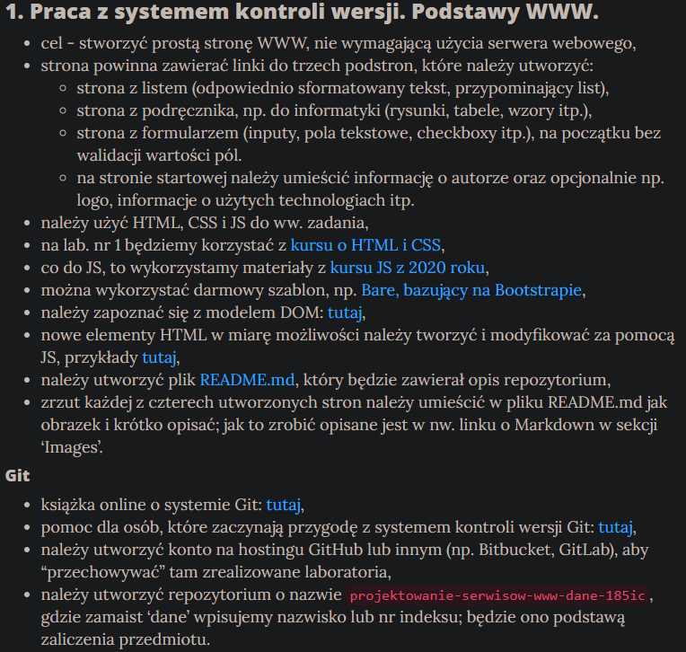
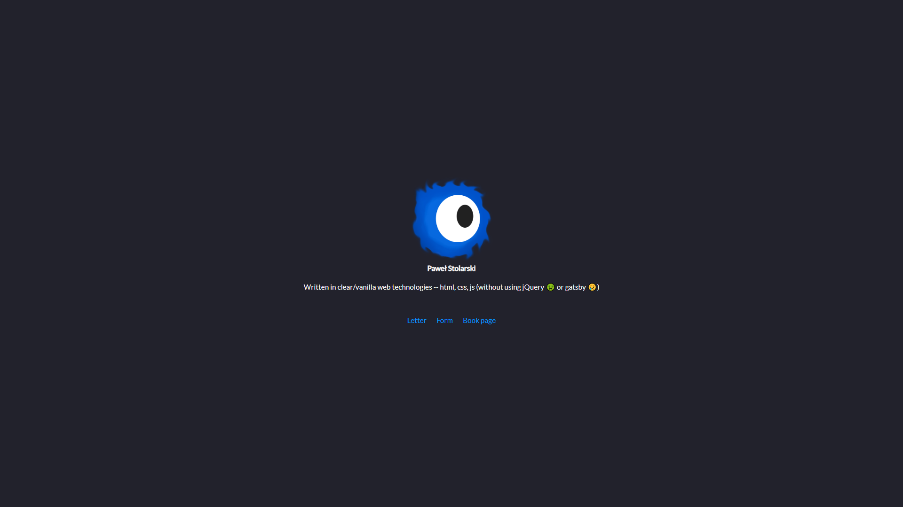
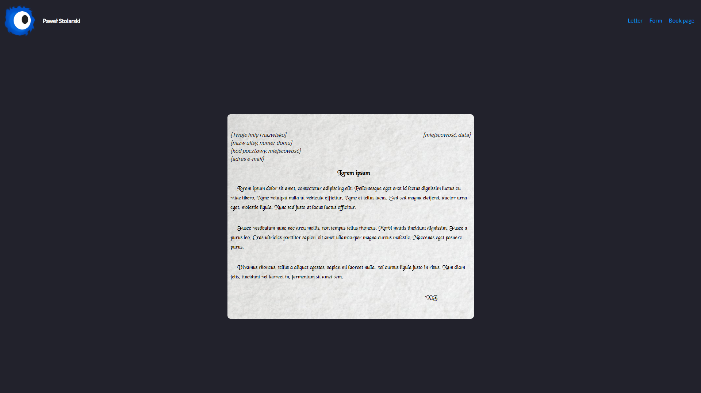
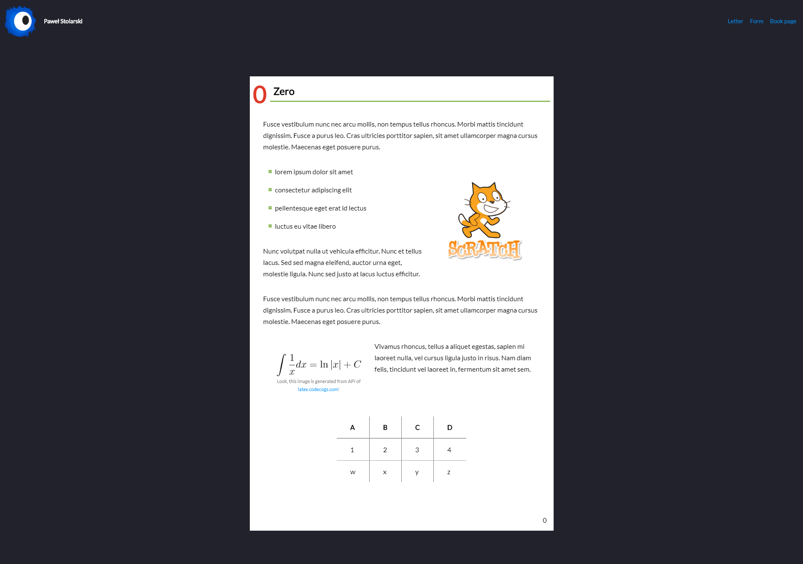
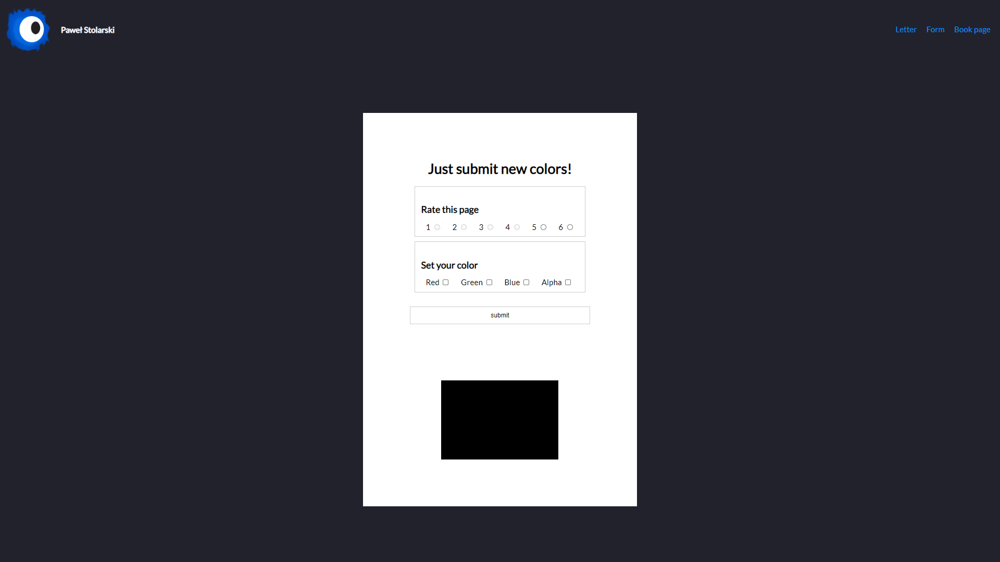

# Task 1

**This file is written in polish lang!**

Jest to (zgodnie z zadaniem) najprostsza strona bez zadnych dodatków.
Czysty html, css, js. Dodatkowo, jako że skrypty ładowane na stronie nie są modułami,
to stronę można ot pobrać w zipie i otworzyć -- piękność statyki.

Link do strony: [evolveye.github.io/projektowanie-serwisow-www-21717-185ic/](https://evolveye.github.io/projektowanie-serwisow-www-21717-185ic/) 
Strona może nie być ciemna jak na screenach, lecz biała.
zwiazane jest to z tym, że zastosowałem media query sprawdzajace motyw kolorystyczny systemu.

Poniżej umieszczam treść zadania wraz z wymaganymi elementami

---

  

  

  

  

  

