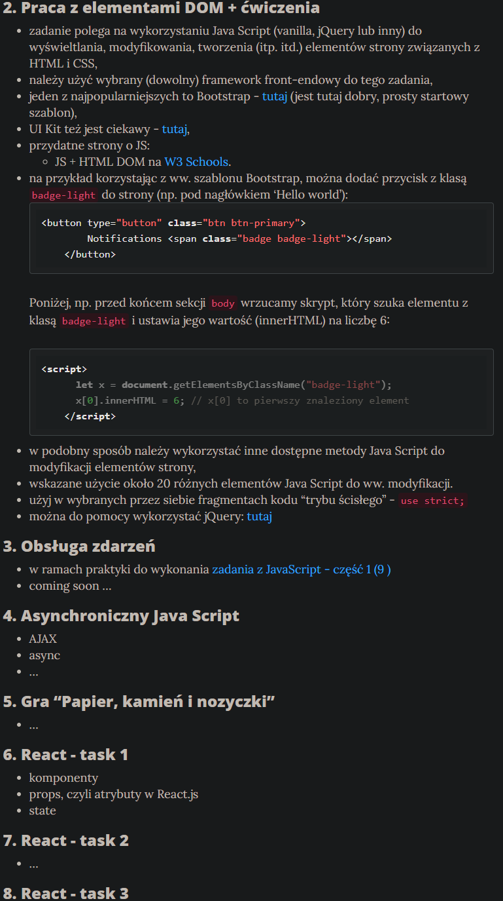

# Task 1

**This file is written in polish lang!**

Jest to (zgodnie z zadaniem) najprostsza strona bez zadnych dodatków.
Czysty html, css, js. Dodatkowo, jako że skrypty ładowane na stronie nie są modułami,
to stronę można ot pobrać w zipie i otworzyć -- piękność statyki.

Link do strony: [evolveye.github.io/projektowanie-serwisow-www-21717-185ic/](https://evolveye.github.io/projektowanie-serwisow-www-21717-185ic/) 
Strona może nie być ciemna jak na screenach, lecz biała.
zwiazane jest to z tym, że zastosowałem media query sprawdzajace motyw kolorystyczny systemu.

## Treść zadania i wymagane screeny

  

  

  

  

  

## Moje projekty które uprzednio spełniają wstępne wymogi pozostałych zadań

Jako, że na stronie z zadaniami zostały wstawione wstępne pomysły na kolejne zadania,
to uznałem ze mógłbym od razu zaprezentować projekty które uważam za spełniajace
przyszłe warunki takowych zadań.

  

 2. **Praca z elementami DOM**: (patrz niżej)
 3. **Obsługa zdarzeń**:
    [Gry na GameJamy](https://github.com/Evolveye/Game_jams) 
    Pierwsze 6 CactuJamów (0-5) wykonałem w `vanilla JS` oraz zwyczajowym HTML oraz CSS.
    Dużo się tam dzieje a modyfikacje DOM najlepiej oddaje **CactuJam 0**.
    To właśnie tam poza elementem canvas na siatce gry pojawiają się różne gify, w UI
    widać coś w rodzaju ekwipunku do/z którego doawane/usuwane są elementy,
    oraz gdyby ktokolwiek zdołał przejsć tę niesamowicie trudną grę to ujrzałby
    wstrzyknięty w HTML ekran końcowy. 
    Jako, ze są to gry "klikacze" to operują głównie na zdarzeniach poruszania i klikania kursorem
    (niestety nie ogólnie wskaźnikiem)
 4. **Asynchroniczny JavaScript**:
    [Bot Discorda](https://github.com/Evolveye/Cactu-discord.js),
    [Szachy RPG](https://github.com/Evolveye/CChess.io/) (link do gry w opisie repozytorium) 
    Discord do komunikator. Taki serwis nie ma prawa istnieć bez asynchroniczności.
    Wszakże każda wiadomość dociera do użytkowników, cóż, asynchronicznie.
    Całą aplikacja opiera się na zdarzeniach WebSocket. Bot Discorda jest niczym innym
    jak skomputeryzowanym użytkownikiem.
    Wszystko na czym się opiera to zdarzenia, których spis można znaleźć w dokumentacji
    [Discord.js, klasie `Client`, kolumnie `Events`](https://discord.js.org/#/docs/main/stable/class/Client).
    Warto dodać, że atutem mojego rozwiązania jest to,
    że polecenia mogę ładować do bota bez potrzeby jego restartowania za pomoca `dynamicznego importowania`

    Szachy RPG z kolei to gra którą zrobiłem z nudów i chęci posiadania jakiejś prostej gry multiplayer.
    Każdy ruch i każde zdarzenie w takiej grze wysyła informacje do serwera,
    ten wiadomość interpretuje i -- jeśli tak wynika ze zdarzenia -- odpowiada.

 5. **Gra "Papier, kamień i nożyczki"**:
    Uważam, że opisane wczesniej produkcje na GameJamy oraz szachy wystarczą

 6. **React -- task 1**: (patrz niżej)
 7. **React -- task 2**: (patrz niżej)
 8. **React -- task 3**:
    [Moja strona na GithubPages](https://evolveye.github.io/),
    [CactuJam 7](https://github.com/Evolveye/Game_jams/tree/master/CactuJam-7) 
    Moją stronę wykonałem w CMSie [gatsby](https://www.gatsbyjs.com/).
    Jest to narzędzie które obudowuje niejako aplikację Reacta w przyjemniejszą w użyciu formę.
    Na repozytorium strony warto wejść na
    [branch dev-gatsby](https://github.com/Evolveye/Evolveye.github.io/tree/dev-gatsby) aby sprawdzić kod.
    W pliku `gatsby.config.js` są wypisane rozszerzenia, które trzeba należało zainstalować z NPM --
    czyli tak samo, jak w zwykłym Reakcie.
    Oczywiście plik `package.json` także istnieje i zawiera zainstalowane dodatki.